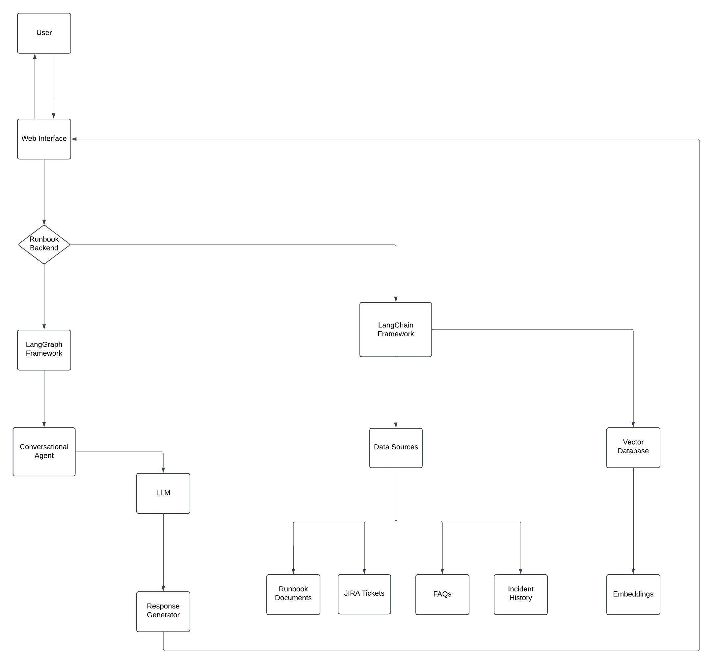

# Runbook Chatbot

## Overview

Runbooks are essential for standardizing procedures, troubleshooting incidents, and guiding teams through common workflows. However, these documents are often static, detailed, and challenging to navigate quickly during high-pressure situations. SREs (Site Reliability Engineers) and GTS (Global Technology Services) teams regularly refer to runbooks, but searching through lengthy documents to find relevant information can be time-consuming and inefficient.

This **Runbook Chatbot** aims to revolutionize how IT teams interact with their runbooks by providing a dynamic and conversational interface. Instead of manually searching through static documents, SREs and GTS teams can simply ask questions or describe problems to receive contextually relevant solutions or steps instantly. This approach enhances efficiency and reduces the potential for errors.

## Problem Statement

Runbooks, while critical, often present the following challenges:

- Static and lengthy formats make them difficult to navigate quickly.
- High-pressure situations require rapid access to relevant information, which static runbooks don't always support.
- Searching for specific troubleshooting steps or procedures can be time-consuming and error-prone.

## Solution

This **Runbook Chatbot** provides a dynamic, conversational interface for interacting with runbook content. By leveraging advanced natural language processing and conversational AI, the chatbot can:

- Understand user queries and provide actionable information based on runbook content.
- Automate the retrieval of troubleshooting steps and routine procedures to improve operational efficiency.
- Enhance real-time collaboration and decision-making with contextually relevant information.

## Objectives

1. **Dynamic Interactions**: Build a chatbot capable of understanding and responding to user queries with actionable information derived from runbook content.
2. **Automation**: Automate the retrieval of troubleshooting steps and standard procedures to save time and improve efficiency.
3. **Contextual Insights**: Provide contextually relevant information to improve real-time collaboration and decision-making during incidents or processes.

## Application Context: AICAS

The **Runbook Chatbot** is specifically designed for the **FICO AI Cloud Analytics Service (AI CAS)**. AI CAS provides a unified user experience for procuring fully managed AI services for use within customer solutions, both external and hosted, on the Decision Management Platform (DMP). The AI CAS user experience targets customer users but may also be leveraged by internal FICO users and includes publishing, provisioning, monitoring, and managing AI CAS services. The chatbot will be tailored to streamline interactions with AI CAS, enhancing the user experience for both internal and external users.

## Tech Stack

- **Backend**: LangChain for natural language processing and conversational AI capabilities.
- **Frontend**: Streamlit for an intuitive and user-friendly interface.

### Example Use Cases:
- **Tenant Onboarding**: "How do I onboard a new tenant?"
- **Provisioning Services**: "What are the steps to provision an AI service?"
- **Monitoring Performance**: "Show me the performance metrics of the AI service deployed last week."
- **Troubleshooting Issues**: "I am facing latency issues with an AI service. What should I check?"

## Flowchart

Below is a flowchart illustrating the overall process of the Runbook Chatbot:

